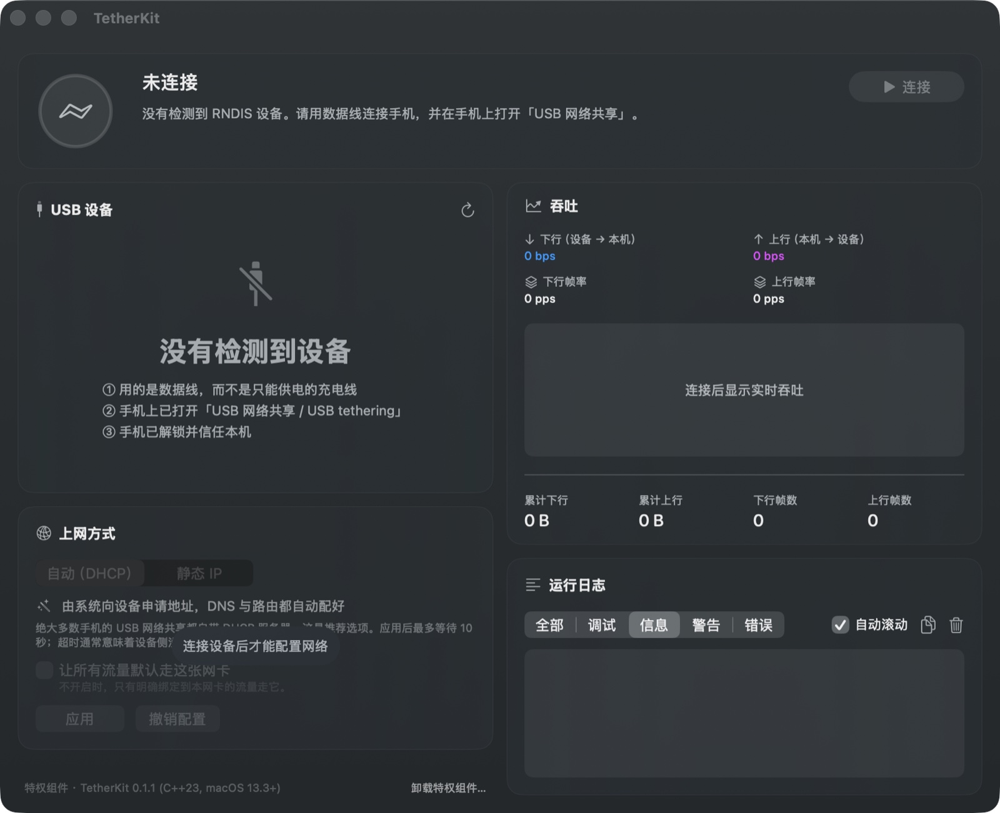

<p align="center">
  
</p>

# TetherKit

**English** | [简体中文](README.md)

**A user-space RNDIS driver for macOS** — no kernel extension required. It turns an RNDIS
device (Android USB tethering, Windows Phone, embedded Linux gadgets, …) into a network
interface that macOS can see and use. Ships with a GUI — pick a device, connect,
configure IP in three clicks — plus a command-line tool, `tetherkit-cli`.



- **USB side**: asynchronous bulk transfers via [libusb](https://libusb.info/), with a complete
  host-side RNDIS state machine.
- **Interface side**: macOS `feth` (`if_fake`) virtual interface pairs + BPF, reading and
  writing raw Ethernet frames directly.
- **No kernel code**: pure user-space C++23. No kext, no DriverKit, no need to disable SIP.

> ⚠️ **Status**: all modules are implemented; 197 test cases (7268 assertions) pass
> under both a normal build and a ThreadSanitizer build. End-to-end throughput,
> measured against a real Android phone: **~326 Mbps RX / ~240–300 Mbps TX, zero
> retransmits in both directions** (USB 2.0 high-speed; theoretical ceiling 426 Mbps).
> Methodology and full results: [docs/BENCHMARKS.md](docs/BENCHMARKS.md); the
> verification checklist lives in [AGENTS.md](AGENTS.md) §6 (Chinese).

---

## Why this exists

The macOS kernel has **no** RNDIS driver. Plug in an Android phone with USB tethering enabled
and no new interface shows up. Existing approaches either ship a kext (requires disabling SIP,
high signing bar, easily broken by system updates) or go through a Network Extension (requires
a developer account plus system-extension approval). TetherKit takes a third route: **act as
both the USB host and the network driver, entirely in user space**.

---

## Installation

```bash
# The GUI, TetherKit.app (macOS 14+)
brew install XiaoMiku01/tap/tetherkit

# The command-line tool, tetherkit-cli (macOS 13.3+)
brew install XiaoMiku01/tap/tetherkit-cli
```

Both formulae build from source and pull in `libusb` automatically. The tap
lives at [XiaoMiku01/homebrew-tap](https://github.com/XiaoMiku01/homebrew-tap).

Launch the GUI like this (on first launch the app drops a Finder alias into
/Applications, so Spotlight can find and launch TetherKit from then on):

```bash
open "$(brew --prefix)/opt/tetherkit/TetherKit.app"
```

On first run the app walks you through installing the privileged helper —
one click, one admin password prompt.

To upgrade:

```bash
brew upgrade tetherkit tetherkit-cli
```

> **Note for existing users**: as of v0.1.2 the formula name `tetherkit` belongs
> to the GUI; the CLI was renamed `tetherkit-cli` (binary included). If you had
> the CLI installed, run `brew uninstall tetherkit && brew install tetherkit-cli`.

You can also grab prebuilt artifacts straight from
[Releases](https://github.com/XiaoMiku01/TetherKit/releases) (arm64 only). They are
**unsigned**, so a browser download gets quarantined by Gatekeeper and you have to
clear the attribute yourself:

```bash
xattr -d com.apple.quarantine tetherkit-cli     # CLI
xattr -dr com.apple.quarantine TetherKit.app    # GUI (recursive)
```

If that bothers you, use Homebrew above, or build it yourself as described in
[Building from source](#building-from-source) — locally built artifacts carry no
quarantine attribute.

---

## Graphical interface

TetherKit.app (SwiftUI) reduces the whole flow to three clicks — pick a device,
connect, configure IP — and shows live throughput and logs.

It comes in two pieces: `TetherKit.app` runs as a **normal user**, and anything
that needs root is handed to `tetherkit-helper`, a privileged component launched
on demand by launchd. Every privileged call carries an authorization credential
the user has just confirmed. The app itself needs no entitlements.

The helper's installation payload is embedded in the .app
(`Contents/Library/HelperTools/`); on first run the app walks you through
installing it (see Installation above). If you prefer the terminal, this is
exactly equivalent:

```bash
sudo ./gui/Scripts/install-helper.sh
```

Uninstall: the dashboard has an "Uninstall privileged component…" button at the
bottom (terminal equivalent: `sudo ./gui/Scripts/uninstall-helper.sh`).

The app lets you choose how the virtual interface gets its address:

| Mode | Notes |
|---|---|
| Automatic (DHCP) | Handled by the system's IPConfiguration — lease, DNS and routes are all set up for you. Most phones ship a DHCP server, so this is the recommended choice |
| Static IP | Enter address, netmask, gateway and DNS yourself. Validated as you type, including netmask contiguity |

There is also a "route all traffic through this interface" switch. With it off,
only traffic explicitly bound to the interface uses it. You usually do not need
it — when no other network is available, macOS picks this interface as the
primary service on its own.

**Background mode**: closing the main window keeps the app in the menu bar
(the Dock icon is hidden) with live up/down rates on the status item; click it
for a compact panel with shortcuts back to the main window. The connection
itself lives in the privileged helper, so quitting the UI never drops it.

**Update check**: "TetherKit → Check for Updates…" checks on demand; the app also
checks once a day on its own (it only hits GitHub's public Releases API and
reports nothing), lighting up a notice at the bottom of the dashboard when a new
version is out. The update itself still goes through `brew upgrade` or a source
rebuild — with certificate-free distribution, auto-replacing the .app would be
blocked by Gatekeeper, so the app deliberately only checks, never swaps. To
disable the automatic check:
`defaults write com.tetherkit.app updateCheckDisabled -bool YES`.

**Requires** macOS 14+ (the CLI still supports 13.3+). Design notes and
trade-offs are in [docs/GUI-ARCHITECTURE.md](docs/GUI-ARCHITECTURE.md).

---

## Command-line tool

Besides the GUI there is a command-line tool, `tetherkit-cli` (installation above):

```bash
# First check whether the device is recognized (**no root needed**)
tetherkit-cli --list

# Start the driver
sudo tetherkit-cli

# In another terminal, configure the new interface (RNDIS devices usually run a DHCP server)
sudo ipconfig set feth0 DHCP
ipconfig getifaddr feth0
```

> The commands above assume an installed `tetherkit-cli` (on your `PATH`). If you
> built from source, substitute `./build/bin/tetherkit-cli`.

On a successful start the program prints the interface it created along with the follow-up
commands. `Ctrl-C` shuts down gracefully (the device is taken out of RNDIS first, then the
interface is destroyed).

Common options (see `--help` for the full list):

| Option | Description |
|---|---|
| `--list` | List detected RNDIS devices and exit; no root required |
| `--vid` / `--pid` | Select a device (hex), for multi-device setups |
| `--stats 1000` | Print a throughput/drop statistics line every second |
| `--log debug` | Enable detailed protocol interaction logging |
| `--max-transfer-kb` | The main throughput tuning knob — see [docs/PERFORMANCE.md](docs/PERFORMANCE.md) |

### Why root is needed

| Operation | Root? | Reason |
|---|---|---|
| Create / destroy `feth` | ✔ | The kernel enforces `proc_suser` on `SIOCIFCREATE2` / `SIOCSDRVSPEC` |
| Open `/dev/bpf*` | ✔ | The nodes are `0600 root:wheel`, and macOS has **no** equivalent of FreeBSD's `access_bpf` group |
| libusb claiming the RNDIS interface | ✘ | The macOS kernel has **no** RNDIS driver, so nothing else holds the interface. A non-sandboxed command line program needs neither root nor an entitlement |

In other words, root is a requirement of the interface side, not the USB side — which is why
`--list` works without it.

---

## Troubleshooting

| Symptom | Cause and fix |
|---|---|
| `--list` finds no device | ① Try a different **data** cable (many are power-only); ② enable "USB tethering" on the device; ③ unlock the phone and trust this computer. Use `system_profiler SPUSBDataType` to check whether the system sees the device at all |
| `claiming the RNDIS data interface failed [libusb: LIBUSB_ERROR_ACCESS]` | Something else owns the interface. Check for a third-party kext such as HoRNDIS, or another user-space program using the device |
| `creating the feth virtual interface requires root` | Run it with `sudo` |
| `sysctl net.link.fake.hwcsum is 1, expected 0` | These switches are **snapshotted when the feth is created**; changing them afterwards has no effect. Do `sudo sysctl -w net.link.fake.hwcsum=0` first, then start |
| `ipconfig set feth0 DHCP` gets no address | Make sure tethering is actually on at the device side; use `--stats 1000` to see whether TX frames go out and RX frames come back |
| Interface is configured but there is no connectivity | The default route still points at the old interface. `sudo route -n change default $(ipconfig getoption feth0 router)` — note this displaces the existing default route |
| Throughput far below expectations | Check the "device aggregation limit N packets" and "link batch write" lines in the startup log, then work through the checklist in [docs/PERFORMANCE.md](docs/PERFORMANCE.md) |
| The interface is gone after a reboot | `ipconfig set` creates a **temporary** service that only lives until the next network configuration change, and never appears in System Settings. That is a macOS limitation, not a bug |

---

## Architecture

```
        ┌──────────────────────────────── macOS kernel ────────────────────────────────┐
        │                                                                              │
        │   IP stack / routing / DHCP client                                           │
        │        │                                                                     │
        │        ▼                                                                     │
        │   ┌─────────┐    if_fake peer pair    ┌─────────┐                            │
        │   │  feth0  │ ◄─────────────────────► │  feth1  │                            │
        │   │(system) │                         │(driver) │                            │
        │   └─────────┘                         └────┬────┘                            │
        │    IP + routes                             │ BPF                             │
        └────────────────────────────────────────────┼─────────────────────────────────┘
                                                     │ read() / write() raw Ethernet frames
        ┌────────────────────────────────────────────┼─────────────────────────────────┐
        │   TetherKit (user space)                   │                                 │
        │                                            ▼                                 │
        │   ┌───────────────────────── data path bridge ─────────────────────────┐     │
        │   │ TX: BPF batch read → coalesce frames → RNDIS_PACKET_MSG → bulk OUT │     │
        │   │ RX: bulk IN → split RNDIS_PACKET_MSG → SPSC queue → BPF write      │     │
        │   └──────────────────────────────────┬─────────────────────────────────┘     │
        │                                      │                                       │
        │   ┌───────── RNDIS state machine ──────────┐                                 │
        │   │ INITIALIZE / QUERY / SET / KEEPALIVE / │                                 │
        │   │ RESET / INDICATE_STATUS / HALT         │                                 │
        │   └────────────────────┬───────────────────┘                                 │
        │                        │                                                     │
        │   ┌───────────────────── libusb ─────────────────────┐                       │
        │   │ control:      SEND_ENCAPSULATED_COMMAND /        │                       │
        │   │               GET_ENCAPSULATED_RESPONSE          │                       │
        │   │ notification: interrupt IN (RESPONSE_AVAILABLE)  │                       │
        │   │ data:         bulk IN / bulk OUT (async, pooled) │                       │
        │   └─────────────────────────┬────────────────────────┘                       │
        └─────────────────────────────┼────────────────────────────────────────────────┘
                                      │ USB
                                ┌─────┴──────┐
                                │RNDIS device│
                                └────────────┘
```

---

## Building from source

Requirements: macOS 13.3+, Xcode command line tools (Apple clang with C++23 support),
CMake ≥ 3.24, libusb 1.0.

```bash
brew install libusb cmake
```

```bash
cmake -S . -B build -DCMAKE_BUILD_TYPE=RelWithDebInfo
cmake --build build -j
```

Output: `build/bin/tetherkit-cli`.

### Building the GUI

Requires the full Xcode toolchain. On top of the build directory above:

```bash
cmake --build build --target gui        # same as ./gui/Scripts/build-gui.sh
open dist/TetherKit.app
```

### Build options

| Option | Default | Description |
|---|---|---|
| `TETHERKIT_BUILD_TESTS` | `ON` | Build unit tests |
| `TETHERKIT_BUILD_BENCHMARKS` | `ON` | Build benchmarks |
| `TETHERKIT_WARNINGS_AS_ERRORS` | `OFF` | Treat warnings as errors |
| `TETHERKIT_NATIVE_ARCH` | `OFF` | `-mcpu=native`; the binary is no longer portable |
| `TETHERKIT_ENABLE_LTO` | `OFF` | Link-time optimization |
| `TETHERKIT_ENABLE_ASAN` | `OFF` | AddressSanitizer |
| `TETHERKIT_ENABLE_UBSAN` | `OFF` | UndefinedBehaviorSanitizer |
| `TETHERKIT_ENABLE_TSAN` | `OFF` | ThreadSanitizer (**required to validate the lock-free structures**) |

### Tests

```bash
ctest --test-dir build --output-on-failure
```

The lock-free queue and the multi-threaded data path are validated separately under
ThreadSanitizer:

```bash
cmake -S . -B build-tsan -DTETHERKIT_ENABLE_TSAN=ON
cmake --build build-tsan -j
ctest --test-dir build-tsan --output-on-failure
```

### Benchmarks

```bash
cmake -S . -B build-rel -DCMAKE_BUILD_TYPE=Release
cmake --build build-rel -j
./build-rel/bin/tetherkit_bench
```

Aggregated results: [docs/BENCHMARKS.md](docs/BENCHMARKS.md).

---

## Documentation

The documents below are written in Chinese.

| Document | Contents |
|---|---|
| [docs/DESIGN.md](docs/DESIGN.md) | **Overall design**: why feth+BPF, module breakdown, concurrency model, teardown ordering, risk assessment of the private ABI |
| [docs/RNDIS-PROTOCOL.md](docs/RNDIS-PROTOCOL.md) | **Protocol reference**: field offsets, status codes, OIDs, state machine, device quirks. Includes the three rules that are easiest to get wrong |
| [docs/PERFORMANCE.md](docs/PERFORMANCE.md) | **Tuning guide**: the knobs, how to identify the bottleneck, known limits |
| [docs/BENCHMARKS.md](docs/BENCHMARKS.md) | **Benchmark results** (auto-generated) + methodology and known limitations |
| [docs/GUI-ARCHITECTURE.md](docs/GUI-ARCHITECTURE.md) | **Graphical interface**: process and trust model, data flow, implementation constraints, what is and is not implemented |
| [docs/GUI-SPIKE.md](docs/GUI-SPIKE.md) | **Feasibility spike**: why privilege escalation is done this way, and the three routes that were ruled out |
| [AGENTS.md](AGENTS.md) | Implementation notes: verified facts about the environment, progress, **pitfalls hit along the way**, and the to-be-verified checklist |

---

## License

See [LICENSE](LICENSE).
