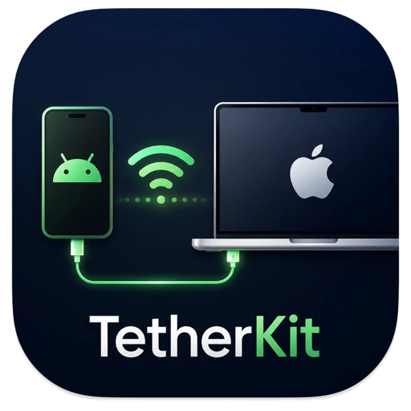
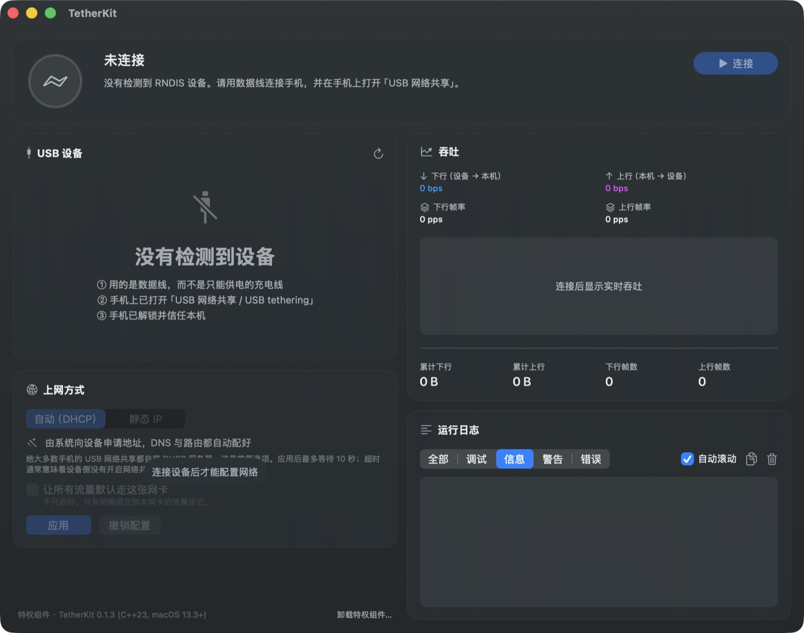

<p align="center">
  
</p>

# TetherKit

[English](README.md) | **简体中文**

**HoRNDIS 在新系统上用不了的替代方案 —— 不装内核扩展，让 Android USB 网络共享在 macOS 上重新可用。**

TetherKit 是一个 **macOS 用户态 RNDIS 驱动**：把 RNDIS 设备（Android 手机的 USB 网络共享、
Windows Phone、嵌入式 Linux gadget 等）变成一张系统可见的网卡，**不需要 kext、不需要
DriverKit、不用关 SIP、不用开发者账号**。Apple Silicon 与 Intel 走同一条代码路径。
自带图形界面，「选设备 → 连接 → 配 IP」三步点击；也提供命令行工具 `tetherkit-cli`。



- **USB 侧**：[libusb](https://libusb.info/) 异步批量传输，完整实现 RNDIS 主机侧状态机。
- **网卡侧**：macOS 的 `feth`（`if_fake`）虚拟网卡对 + BPF，直接读写原始以太帧。
- **无内核代码**：纯用户态 C++23，不需要 kext、不需要 DriverKit、不需要关 SIP。

> ⚠️ **状态**：全部模块已实现，221 个测试用例（10569 条断言）在普通构建与
> ThreadSanitizer 构建下均通过。端到端已用 Android 手机压测：**RX 约 326 Mbps /
> TX 约 240~300 Mbps，双向零重传**（USB 2.0 高速，理论上限 426 Mbps）。
> 测量方法与完整结果见 [docs/BENCHMARKS.md](docs/BENCHMARKS.md)，
> 验证清单见 [AGENTS.md](AGENTS.md) 第 6 节。

> **版本**：**0.1.6**（BETA）。
> - **构建戳**（由 `gui/Scripts/build-gui.sh` 构建时自动写入 `CFBundleVersion`）：
>   `{YYYYMMDD}-BETA-{仓库}-{commit}`，例如 `20260801-BETA-XenOriginal/TetherKit-a1b2c3d`
>   —— 构建日期、`BETA` 标记、仓库（`XenOriginal/TetherKit`）以及本构建对应的
>   确切 commit。任意 `.app` 都可据此回溯到具体 commit。
> - **主要变更**：消除了连接状态下 GUI 约 40% 的 CPU 占用（状态环的 `.repeatForever` 永久呼吸动画
>   在连接期间改为静态，详见 [docs/PERFORMANCE-GUI-CPU-ROOTCAUSE.md](docs/PERFORMANCE-GUI-CPU-ROOTCAUSE.md)）；
>   并稳定了 IP 地址显示（接口瞬空查询不再导致地址反复横跳）。

---

## 从 HoRNDIS 过来的？

如果你是因为 **HoRNDIS 升级完 macOS 就用不了了**，或者在 Apple Silicon 上它一直显示
「已阻止的软件」、根本找不到那个「允许」按钮 —— TetherKit 就是为这种情况写的。

[HoRNDIS](https://github.com/jwise/HoRNDIS) 好用了很多年，它本身没有问题。问题在于它是一个
**内核扩展**，而这正是 macOS 一直在收紧的地方：

| | HoRNDIS | TetherKit |
|---|---|---|
| 是什么 | 内核扩展（kext） | 普通的用户态程序 |
| Apple Silicon | 要先进恢复模式把安全策略降到「降低安全性」并重启，第三方 kext 才**有可能**加载 | 什么都不用改 —— 在系统眼里它根本不是驱动 |
| SIP | 通常需要关掉或削弱 | 不动 |
| 升级 macOS 之后 | kext 可能直接不加载，往往要重新批准或重新编译 | 就是个 App，没有什么要重新批准的 |
| 出问题的最坏情况 | 内核崩溃（kernel panic） | 进程退出 |
| 上游状态 | 最新发布 9.2（2024 年 8 月）；[「MacOS Sonoma not supported」](https://github.com/jwise/HoRNDIS/issues/169) 仍未关闭 | 在积极开发 |

TetherKit 是从另一头解决同一个问题：不去教内核说 RNDIS，而是**在用户态**通过 libusb 把
RNDIS 说完，再借 `feth` 虚拟网卡对把以太帧交给系统。内核自始至终没有加载我们的任何代码。

**代价说在前面**：网卡由一个需要你启动的 App 创建（连接本身不受界面退出影响 —— 它跑在一个
很小的特权后台组件里）；吞吐受限于用户态拷贝而不是 USB 链路。不过实测下来这并没有成为瓶颈，
数据见上面。

---

## 为什么需要它

macOS 内核**没有** RNDIS 驱动。插上开了 USB 网络共享的 Android 手机，系统不会出现新网卡。
既有方案要么写 kext（需要关 SIP 或降低 Apple Silicon 的安全策略、签名门槛高、系统更新易
失效），要么走 Network Extension（需要开发者账号 + 系统扩展审批）。TetherKit 选择第三条
路：**在用户态同时扮演 USB 主机和网卡驱动**。

---

## 安装

**兼容性**：macOS 14 Sonoma、15 Sequoia、26 Tahoe，Apple Silicon（M1–M4）与 Intel 都支持；
命令行工具最低到 macOS 13.3 Ventura。**什么都不用关** —— SIP 保持开启，Apple Silicon 的
安全策略保持「完全安全性」。

```bash
# 图形界面 TetherKit.app（macOS 14+）
brew install XiaoMiku01/tap/tetherkit

# 命令行工具 tetherkit-cli（macOS 13.3+）
brew install XiaoMiku01/tap/tetherkit-cli
```

两个 formula 都从源码构建，`libusb` 会被自动带上。tap 仓库在
[XiaoMiku01/homebrew-tap](https://github.com/XiaoMiku01/homebrew-tap)。

图形界面装完这样启动（首次启动会自动在「应用程序」里建立 Finder 别名，
之后在聚焦里搜 TetherKit 即可直接启动）：

```bash
open "$(brew --prefix)/opt/tetherkit/TetherKit.app"
```

首次运行界面会引导安装特权组件：点「安装特权组件」、输一次管理员密码即可。

升级：

```bash
brew upgrade tetherkit tetherkit-cli
```

> **旧版用户注意**：自 v0.1.2 起 `tetherkit` 这个 formula 名归图形界面，
> 命令行改名 `tetherkit-cli`（二进制同名）。之前装过命令行的请
> `brew uninstall tetherkit && brew install tetherkit-cli`。

也可以从 [Releases](https://github.com/XiaoMiku01/TetherKit/releases) 直接下预编译产物
（仅 arm64）。但它们**没有签名**，浏览器下载后会被 Gatekeeper 隔离，得手动解除：

```bash
xattr -d com.apple.quarantine tetherkit-cli     # 命令行
xattr -dr com.apple.quarantine TetherKit.app    # 图形界面（递归）
```

介意这一步的话就走上面的 Homebrew，或者按下文「[从源码构建](#从源码构建)」自己构建
—— 本地构建的产物不带隔离属性。

---

## 图形界面

TetherKit.app（SwiftUI）把「选设备 → 连接 → 配 IP」做成了三步点击，实时显示吞吐与日志。

它由两部分组成：`TetherKit.app` 以**普通用户身份**运行，需要 root 的操作交给一个
由 launchd 按需拉起的特权组件 `tetherkit-helper`，每次调用都附带一份用户刚确认过
的授权凭据。App 本身不需要任何 entitlement。

特权组件的安装载荷内嵌在 .app 里（`Contents/Library/HelperTools/`），首次运行时
界面会引导安装（见上文「安装」）；偏好终端的话效果完全相同：

```bash
sudo ./gui/Scripts/install-helper.sh
```

卸载：仪表盘底部有「卸载特权组件…」按钮（终端等价命令
`sudo ./gui/Scripts/uninstall-helper.sh`）。

界面里可以配置**上网方式**：

| 方式 | 说明 |
|---|---|
| 自动（DHCP） | 交给系统的 IPConfiguration，租约、DNS、路由全部自动配好。绝大多数手机都自带 DHCP 服务器，推荐 |
| 静态 IP | 手动指定 IP、子网掩码、网关与 DNS。输入时即时校验（含子网掩码的连续性） |

另有一个「让所有流量默认走这张网卡」开关。不开时只有绑定到本网卡的流量走它；
本机没有别的可用网络时通常不需要开 —— 系统会自己把它选为主服务。

**后台运行**：关闭主窗口后 App 驻留菜单栏（程序坞图标隐藏），菜单栏项实时
显示上/下行速率；点开是一块小面板，可随时回到主窗口或退出。已建立的连接由
特权组件持有，即使退出界面也不会断。

**检查更新**：菜单「TetherKit → 检查更新…」手动查；App 也会每天自动查一次
（只访问 GitHub 的公开 Releases API，不上报任何信息），发现新版在仪表盘
底部点亮一条提示。更新本身仍走 `brew upgrade` 或源码重编 —— 免证书分发下
自动替换 .app 会被 Gatekeeper 拦下，所以刻意只查不换。不想要自动检查：
`defaults write com.tetherkit.app updateCheckDisabled -bool YES`。

**界面语言**：菜单「TetherKit → 语言」可选「跟随系统 / 中文 / English」，
菜单栏面板里也有同一个开关。切换**立即生效**，不需要重启 App —— 库产生的
日志行也会跟着换（语言会一并同步给特权组件）。默认跟随系统语言。

**要求**：macOS 14+（命令行部分仍支持 13.3+）。实现细节与设计取舍见
[docs/GUI-ARCHITECTURE.md](docs/GUI-ARCHITECTURE.md)。

---

## 命令行工具

图形界面之外还有命令行工具 `tetherkit-cli`（安装见上文）：

```bash
# 先看看设备有没有被识别（**不需要 root**）
tetherkit-cli --list

# 启动驱动
sudo tetherkit-cli

# 另开一个终端，给新出现的网卡配 IP（RNDIS 设备通常自带 DHCP 服务器）
sudo ipconfig set feth0 DHCP
ipconfig getifaddr feth0
```

> 上面的命令都按已安装（`tetherkit-cli` 在 PATH 里）来写。从源码构建的话
> 换成 `./build/bin/tetherkit-cli` 即可。

启动成功后程序会打印它创建的网卡名与后续命令。按 `Ctrl-C` 优雅退出
（会先让设备退出 RNDIS，再销毁网卡）。

常用选项（完整列表见 `--help`）：

| 选项 | 说明 |
|---|---|
| `--list` | 列出识别到的 RNDIS 设备后退出，不需要 root |
| `--vid` / `--pid` | 指定设备（十六进制），用于多设备场景 |
| `--stats 1000` | 每秒打印一行吞吐/丢包统计 |
| `--log debug` | 打开协议交互细节日志 |
| `--max-transfer-kb` | 吞吐的主要调优旋钮，见 [docs/PERFORMANCE.md](docs/PERFORMANCE.md) |
| `--lang zh\|en\|auto` | 界面语言，默认 `auto`（见下） |

**语言**：默认按 `TETHERKIT_LANG` → `LC_ALL` → `LC_MESSAGES` → `LANG` 依次推断，
取第一个非空值，以 `zh` 开头算中文、其余算英文。

```bash
tetherkit-cli --lang en --help     # 显式指定
TETHERKIT_LANG=en tetherkit-cli --list
```

> ⚠️ `sudo` 是否把 `LANG` 透传给命令取决于 sudoers 的 `env_keep`，因此
> `sudo tetherkit-cli` 未必跟随你的终端语言 —— 那时显式写 `--lang`。

### 为什么需要 root

| 操作 | 需要 root？ | 原因 |
|---|---|---|
| 创建 / 销毁 `feth` | ✔ | 内核对 `SIOCIFCREATE2` / `SIOCSDRVSPEC` 有 `proc_suser` 检查 |
| 打开 `/dev/bpf*` | ✔ | 节点是 `0600 root:wheel`，且 macOS **没有** FreeBSD 的 `access_bpf` 组 |
| libusb 声明 RNDIS 接口 | ✘ | macOS 内核**没有** RNDIS 驱动，接口本来就没人占。非沙箱命令行程序不需要 root、也不需要 entitlement |

也就是说 root 是网卡侧的要求，不是 USB 侧的。`--list` 因此不需要 root。

---

## 故障排查

| 现象 | 原因与对策 |
|---|---|
| `--list` 找不到设备 | ① 换一根**数据线**（很多线只供电）；② 在设备上开启「USB 网络共享 / USB tethering」；③ 解锁手机并信任本机。用 `system_profiler SPUSBDataType` 确认系统是否看到该设备 |
| `声明 RNDIS 数据接口失败 [libusb: LIBUSB_ERROR_ACCESS]` | 接口被别的东西占了。检查是否装过 HoRNDIS 之类的第三方 kext，或有别的用户态程序在用该设备 |
| `创建 feth 虚拟网卡需要 root` | 用 `sudo` 运行 |
| `sysctl net.link.fake.hwcsum 当前是 1，要求 0` | 这批开关在 feth **创建时被快照**，创建后改无效。按提示先 `sudo sysctl -w net.link.fake.hwcsum=0` 再启动 |
| `ipconfig set feth0 DHCP` 拿不到地址 | 确认设备侧的网络共享真的开着；用 `--stats 1000` 看 TX 有没有帧发出去、RX 有没有回包 |
| 网卡配好了但上不了网 | 默认路由还指向原来的网卡。`sudo route -n change default $(ipconfig getoption feth0 router)`，注意这会顶掉现有默认路由 |
| 吞吐远低于预期 | 看启动日志里的「设备聚合上限 N 包」与「链路批量写」两项，再对照 [docs/PERFORMANCE.md](docs/PERFORMANCE.md) 的排查表 |
| 重启后网卡不见了 | `ipconfig set` 建立的是**临时**服务，只存活到下一次网络配置变更，且不出现在系统设置里。这是 macOS 的限制，不是 bug |

### 常见疑问

**Android 的 USB 网络共享在 macOS 上到底能不能用？**
开箱即用是不能的 —— macOS 不带 RNDIS 驱动，插上开了 USB 网络共享的手机，系统里不会多出
任何网卡。TetherKit 补的就是这一块。

**要关 SIP 吗？Apple Silicon 上要降安全策略吗？**
都不用。那些是**内核扩展**的要求。TetherKit 是普通程序，内核不会加载它的任何代码；需要
特权的只是一个后台小组件，安装时输一次管理员密码，之后不再打扰。

**HoRNDIS 显示「已阻止的软件」、没有「允许」按钮，能修吗？**
那是 macOS 在拒绝加载第三方 kext，不是 kext 自己能解决的。Apple Silicon 上想加载它，必须
先进恢复模式降低安全策略。TetherKit 从根上绕开了这一整类问题。

**M1 / M2 / M3 / M4 能用吗？**
能。Apple Silicon 与 Intel 走同一条代码路径，除了编译目标之外没有任何架构相关的东西。

**我的设备支持吗？**
只要它暴露 RNDIS 接口就行：多数开了 USB 网络共享的 Android 手机、Windows Phone，以及
Linux 的 `g_ether` / `u_ether` USB gadget（树莓派 Zero、BeagleBone 等）。
跑 `tetherkit-cli --list` 就能确认，**不需要 root**。

**iPhone 的 USB 共享需要它吗？**
不需要。macOS 原生支持 iPhone 的 USB 网络共享，TetherKit 面向的是它不覆盖的那些设备。

---

## 架构

```
        ┌──────────────────────────── macOS 内核 ────────────────────────────┐
        │                                                                    │
        │   IP 栈 / 路由 / DHCP 客户端                                        │
        │        │                                                           │
        │        ▼                                                           │
        │   ┌─────────┐   if_fake peer 对   ┌─────────┐                       │
        │   │  feth0  │ ◄─────────────────► │  feth1  │                       │
        │   │(系统侧) │                     │(驱动侧) │                       │
        │   └─────────┘                     └────┬────┘                      │
        │    配 IP/路由                          │ BPF                       │
        └────────────────────────────────────────┼───────────────────────────┘
                                                 │ read()/write() 原始以太帧
        ┌────────────────────────────────────────┼───────────────────────────┐
        │                     TetherKit（用户态） │                           │
        │                                        ▼                           │
        │   ┌──────────────────── 数据路径桥接 ─────────────────────┐         │
        │   │  TX: BPF 批量读 → 聚合多帧 → RNDIS_PACKET_MSG → bulk OUT│        │
        │   │  RX: bulk IN → 拆 RNDIS_PACKET_MSG → SPSC 队列 → BPF 写 │        │
        │   └───────────────────────────┬───────────────────────────┘         │
        │                               │                                     │
        │   ┌──────────── RNDIS 状态机 ──┴──────────────┐                      │
        │   │ INITIALIZE / QUERY / SET / KEEPALIVE /   │                      │
        │   │ RESET / INDICATE_STATUS / HALT           │                      │
        │   └───────────────────────────┬──────────────┘                      │
        │                               │                                     │
        │   ┌────────── libusb ─────────┴──────────────┐                      │
        │   │ 控制通道：SEND_ENCAPSULATED_COMMAND /     │                      │
        │   │           GET_ENCAPSULATED_RESPONSE      │                      │
        │   │ 通知通道：中断 IN（RESPONSE_AVAILABLE）    │                      │
        │   │ 数据通道：bulk IN / bulk OUT（异步池化）   │                      │
        │   └───────────────────────────┬──────────────┘                      │
        └───────────────────────────────┼─────────────────────────────────────┘
                                        │ USB
                                   ┌────┴─────┐
                                   │ RNDIS 设备 │
                                   └──────────┘
```

---

## 从源码构建

依赖：macOS 13.3+、Xcode 命令行工具（Apple clang 支持 C++23）、CMake ≥ 3.24、libusb 1.0。

```bash
brew install libusb cmake
```

```bash
cmake -S . -B build -DCMAKE_BUILD_TYPE=RelWithDebInfo
cmake --build build -j
```

产物：`build/bin/tetherkit-cli`。

### 构建图形界面

需要完整 Xcode 工具链。在上面的构建目录基础上：

```bash
cmake --build build --target gui        # 等价于 ./gui/Scripts/build-gui.sh
open dist/TetherKit.app
```

### 构建选项

| 选项 | 默认 | 说明 |
|---|---|---|
| `TETHERKIT_BUILD_TESTS` | `ON` | 构建单元测试 |
| `TETHERKIT_BUILD_BENCHMARKS` | `ON` | 构建性能基准 |
| `TETHERKIT_WARNINGS_AS_ERRORS` | `OFF` | 警告当错误 |
| `TETHERKIT_NATIVE_ARCH` | `OFF` | `-mcpu=native`，产物不可移植 |
| `TETHERKIT_ENABLE_LTO` | `OFF` | 链接时优化 |
| `TETHERKIT_ENABLE_ASAN` | `OFF` | AddressSanitizer |
| `TETHERKIT_ENABLE_UBSAN` | `OFF` | UndefinedBehaviorSanitizer |
| `TETHERKIT_ENABLE_TSAN` | `OFF` | ThreadSanitizer（**验证无锁数据结构必备**） |

### 测试

```bash
ctest --test-dir build --output-on-failure
```

无锁队列与多线程数据路径的正确性用 ThreadSanitizer 单独验证：

```bash
cmake -S . -B build-tsan -DTETHERKIT_ENABLE_TSAN=ON
cmake --build build-tsan -j
ctest --test-dir build-tsan --output-on-failure
```

### 性能基准

```bash
cmake -S . -B build-rel -DCMAKE_BUILD_TYPE=Release
cmake --build build-rel -j
./build-rel/bin/tetherkit_bench
```

汇总结果见 [docs/BENCHMARKS.md](docs/BENCHMARKS.md)。

---

## 文档

| 文档 | 内容 |
|---|---|
| [docs/DESIGN.md](docs/DESIGN.md) | **总体设计**：为什么选 feth+BPF、模块划分、并发模型、拆除顺序、私有 ABI 的风险评估 |
| [docs/RNDIS-PROTOCOL.md](docs/RNDIS-PROTOCOL.md) | **协议参考**：字段偏移、状态码、OID、状态机、设备 quirk。含三条最容易搞错的规则 |
| [docs/PERFORMANCE.md](docs/PERFORMANCE.md) | **调优指南**：旋钮、怎么判断瓶颈、已知限制 |
| [docs/BENCHMARKS.md](docs/BENCHMARKS.md) | **基准结果**（自动生成）+ 测量方法与已知局限 |
| [docs/GUI-ARCHITECTURE.md](docs/GUI-ARCHITECTURE.md) | **图形界面**：进程与信任模型、数据流、实现约束、已实现/未实现清单 |
| [docs/GUI-SPIKE.md](docs/GUI-SPIKE.md) | **可行性验证**：为什么这么做特权提升，以及被排除的三条路线 |
| [AGENTS.md](AGENTS.md) | 实现备忘：已实测确认的环境事实、进度、**踩过的坑**、待验证清单 |

---

## 许可

见 [LICENSE](LICENSE)。
